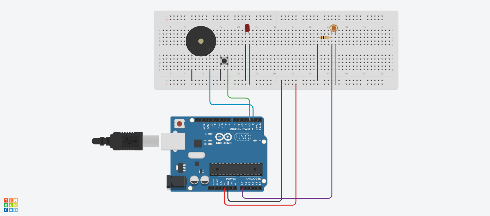
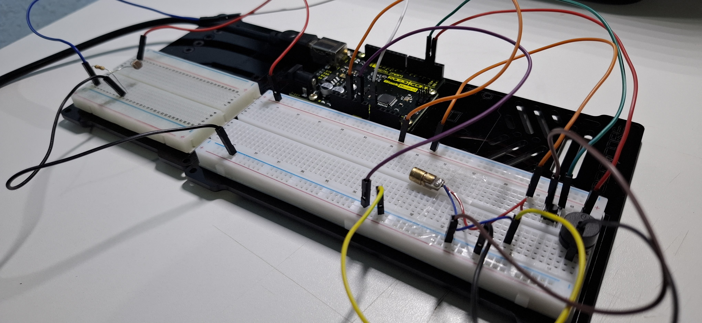

# Alarme de Segurança com Laser

Este projeto em um protótipo simples de um sistema de alarme de segurança. O sistema utiliza um diodo laser e um sensor de luminosidade para detectar movimentações e acionar um sinal sonoro.

  
---
## Componentes utilizados
  - Arduino Uno (1x)
  - Diodo Laser 5 V (1x)
  - Sensor de Luminosidade LDR 5 mm (1x)
  - Buzzer Passivo 5 V (1x)
  - Chave Momentânea (PushButton) (1x)
  - Resistor 10 kΩ (1x)
  - Protoboard (2x)
  - Jumpers

---
## Esquemático do Circuito

  

 

**Legenda:**
  - D2 -> Buzzer (+)
  - D3 -> Botão
  - A0 -> Sensor LDR
  - 5 V -> Sensor LDR
  - 5 V -> LED Vermelho (Diodo Laser)
  - Resistores: 10 kΩ

---
## Montagem e Funcionamento

  

 

🎥 **Vídeo do Funcionamento:**  
👉 [Acesse clicando aqui!](https://youtu.be/NmrYu79-7XM)

---
## Código do Projeto
Quer ver como esse projeto foi programado?  
👉 [Acesse o código clicando aqui!](src/Alarme-de-Seguranca.ino)
